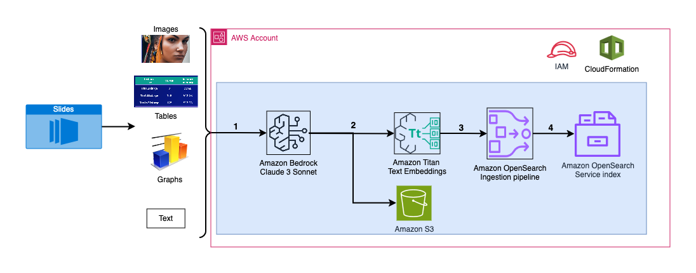
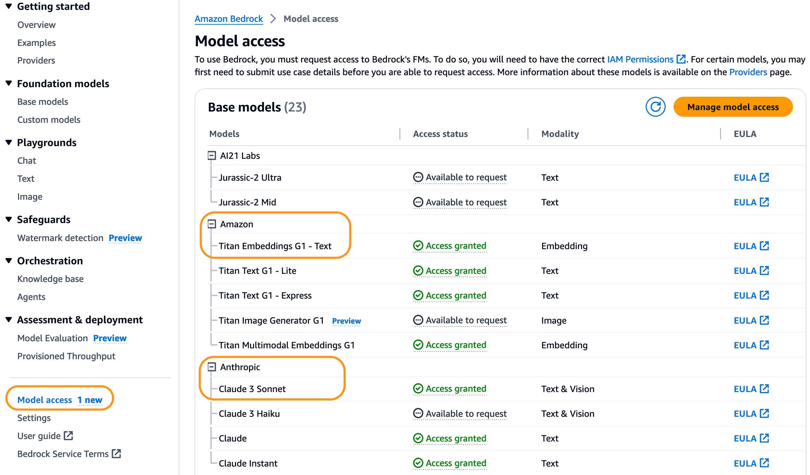
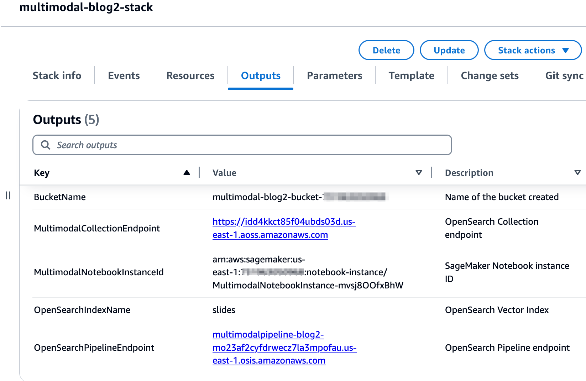
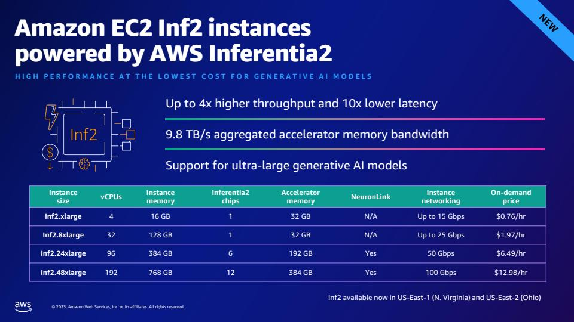
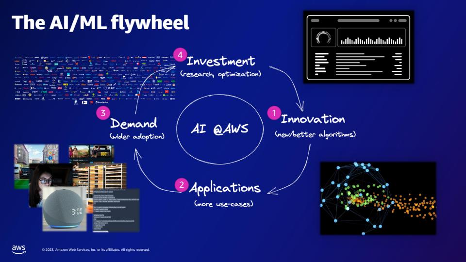
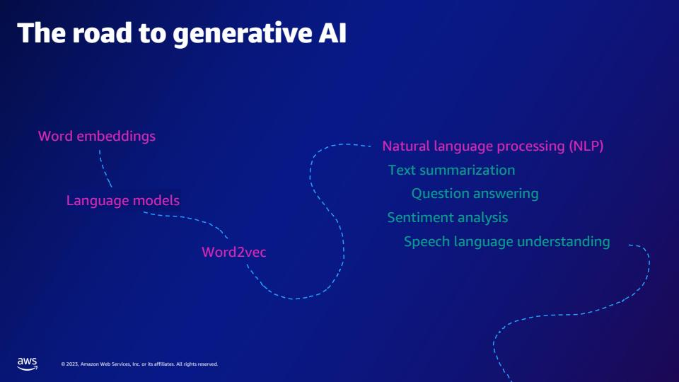

# Talk to your slide deck (Multimodal RAG) using foundation models (FMs) hosted on Amazon Bedrock – Part 2

*Amit Arora*, *Archana Inapudi*, *Manju Prasad*, *Antara Raisa*

In [part
1](https://aws.amazon.com/blogs/machine-learning/talk-to-your-slide-deck-using-multimodal-foundation-models-hosted-on-amazon-bedrock-and-amazon-sagemaker-part-1/)
of this series, we presented a solution that used [Amazon Titan
Multimodal
Embeddings](https://docs.aws.amazon.com/bedrock/latest/userguide/titan-multiemb-models.html)
model to convert individual slides from a slide deck into embeddings. We
stored the embeddings in a vector database and then used the [Large
Language-and-Vision Assistant (LLaVA
1.5-7b)](https://llava-vl.github.io/) model to generate text responses
to user questions based on the most similar slide retrieved from the
vector database. We used AWS services including [Amazon
Bedrock](https://aws.amazon.com/bedrock/), [Amazon
SageMaker](https://aws.amazon.com/sagemaker/), and [Amazon OpenSearch
Serverless](https://aws.amazon.com/opensearch-service/features/serverless/)
in this solution.

In part 2 of this series, we demonstrate a different approach. We use
[Anthropic Claude 3 Sonnet](https://aws.amazon.com/bedrock/claude/)
model to generate text descriptions for each slide in the slide deck.
These descriptions are then converted into text embeddings using [Amazon
Titan Text
Embeddings](https://docs.aws.amazon.com/bedrock/latest/userguide/titan-embedding-models.html)
model and stored in a vector database. Then we use the Claude 3 Sonnet
model to generate answers to user questions based on the most relevant
text description retrieved from the vector database.

You can test both approches for your dataset and evaluate the results to
see which approach gives you the best results. Evaluation of the results
is a topic that we will explore in part 3 of this series.

## Solution overview

The solution presented provides an implementation for answering
questions using information contained in text and visual elements of a
slide deck. The design relies on the concept of Retrieval Augmented
Generation (RAG). Traditionally, RAG has been associated with textual
data that can be processed by LLMs. In this series, we extend RAG to
include images as well. This provides a powerful search capability to
extract contextually relevant content from visual elements like tables
and graphs along with text.

This solution includes the following components:

- **Amazon Titan Text Embeddings** is a text embeddings model that
  converts natural language text including single words, phrases, or
  even large documents, into numerical representations that can be used
  to power use cases such as search, personalization, and clustering
  based on semantic similarity.
- **Anthropic Claude 3 Sonnet** is the next generation of
  state-of-the-art models from Anthropic. Sonnet is a versatile tool
  that can handle a wide range of tasks, from complex reasoning and
  analysis to rapid outputs, as well as efficient search and retrieval
  across vast amounts of information.
- **Amazon OpenSearch Service Serverless** is an on-demand serverless
  configuration for Amazon OpenSearch Service. We use OpenSearch Service
  Serverless as a vector database for storing embeddings generated by
  the Titan Multimodal Embeddings model. An index created in the
  OpenSearch Service Serverless collection serves as the vector store
  for our RAG solution.
- [Amazon OpenSearch
  Ingestion](https://docs.aws.amazon.com/opensearch-service/latest/developerguide/ingestion.html)
  (OSI) is a fully managed, serverless data collector that delivers data
  to Amazon OpenSearch Service domains and OpenSearch Serverless
  collections. In this blog, we use an OSI pipeline API to deliver data
  to the OpenSearch Serverless vector store.

## Solution design

The solution design consists of two parts - Ingestion and User
interaction. During ingestion, we process the input slide deck by
converting each slide into an image, generating descriptions and text
embeddings for each image. We then populate the vector data store with
the embeddings and text description for each slide. These steps are
completed prior to the user interaction steps.

In the User interaction phase, a question from the user is converted
into text embeddings. A similarity search is run on the vector database
to find a text description corresponding to a slide that could
potentially contain answers to the user question. We then provide the
slide description and the user question to the Claude 3 Sonnet model to
generate an answer to the query. All the code for this post is available
in the
[GitHub](https://github.com/aws-samples/multimodal-rag-on-slide-decks/tree/main/Blog2-LVM-TitanEmbeddings)
repo.

### Ingestion steps:



1.  1.  Slides are converted to image files (one per slide) in the JPG
        format and passed to Claude 3 Sonnet model to generate text
        description and then to Titan Text Embeddings model to generate
        embeddings. In this series, we use slide deck titled [Train and
        deploy Stable Diffusion using AWS Trainium & AWS
        Inferentia](https://d1.awsstatic.com/events/Summits/torsummit2023/CMP301_TrainDeploy_E1_20230607_SPEdited.pdf)
        from the AWS Summit in Toronto, June 2023 to demonstrate the
        solution.

    - The sample deck has 31 slides and thus we generate 31 sets of
      vector embeddings, each with 1536 dimensions. We add additional
      metadata fields to perform rich search queries using OpenSearch’s
      powerful search capabilities.

2.  The embeddings are ingested into OSI pipeline via an API call, the
    OSI pipeline in turn ingests the data as documents into the
    OpenSearch Service Serverless index.
    - Note that the OpenSearch Service Serverless index is configured as
      the sink for this pipeline and it is created as part of the
      OpenSearch Service Serverless collection.

### User interaction steps:


1.  A user submits a question related to the slide deck that has been
    ingested.
2.  The user input is converted into embeddings using the Titan Text
    Embeddings model accessed via Bedrock. An OpenSearch vector search
    is performed using these embeddings. We perform a K-Nearest Neighbor
    search to retrieve the most relevant embedding matching the user
    query.
3.  The metadata of the response from OpenSearch Services Serverless
    contains a path to the image and description corresponding to the
    most relevant slide.
4.  A prompt is created by combining the user question and the image
    description. The prompt is provided to Claude 3 Sonnet hosted on
    Bedrock.
5.  Result of this inference is returned to the user.

These steps are discussed in detail in the following sections. See
Results section for screenshots and details on the output.

## Prerequisites

To implement the solution provided in this post, you should have an [AWS
account](https://signin.aws.amazon.com/signin?redirect_uri=https%3A%2F%2Fportal.aws.amazon.com%2Fbilling%2Fsignup%2Fresume&client_id=signup)
and familarity with FMs, Bedrock, SageMaker, and OpenSearch Service.

This solution uses the Claude 3 Sonnet and Titan Text embeddings models
hosted on Amazon Bedrock. Ensure that these models are enabled for use
in Amazon Bedrock. In AWS Management Console → Amazon Bedrock, select
Model access. If models are enabled, the Access status will state
“Access granted” as below.



If the models are not available, enable access by clicking on “Manage
Model Access”, selecting “Titan Embeddings G1 - Text” and “Claude 3
Sonnet” and clicking on Request model access. The models are enabled for
use immediately.

## Use AWS CloudFormation template to create the solution stack

<i>Note: If you have created the solution for Part 1 in the same AWS
account, be sure to delete that before creating this solution stack.</i>

| AWS Region |                                                                                                                                         Link                                                                                                                                          |
|:----------:|:-------------------------------------------------------------------------------------------------------------------------------------------------------------------------------------------------------------------------------------------------------------------------------------:|
| us-east-1  | [](https://console.aws.amazon.com/cloudformation/home?region=us-east-1#/stacks/new?stackName=multimodal-blog2-stack&templateURL=https://aws-blogs-artifacts-public.s3.amazonaws.com/artifacts/ML-16123-2/template.yml) |
| us-west-2  | [](https://console.aws.amazon.com/cloudformation/home?region=us-west-2#/stacks/new?stackName=multimodal-blog2-stack&templateURL=https://aws-blogs-artifacts-public.s3.amazonaws.com/artifacts/ML-16123-2/template.yml) |

After the stack is created successfully, navigate to the stack’s
`Outputs` tab on the AWS CloudFormation console and note the values for
`MultimodalCollectionEndpoint` and `OpenSearchPipelineEndpoint`, we will
use it in the subsequent steps.



The CloudFormation template creates the following resources:

- `IAM roles`: the following two IAM roles are created. Update these
  roles to apply least-privilege permissions as discussed in [Security
  best
  practices](https://docs.aws.amazon.com/IAM/latest/UserGuide/best-practices.html#grant-least-privilege).
  - `SMExecutionRole` with S3, SageMaker, OpenSearch Service, and
    Bedrock full access.
  - `OSPipelineExecutionRole` with access to the S3 bucket and OSI
    actions.
- `SageMaker Notebook`: all code for this post is run via this notebook.
- `OpenSearch Service Serverless collection`: vector database for
  storing and retrieving embeddings.
- `OSI Pipeline`: pipeline for ingesting data into OpenSearch Service
  Serverless.
- `S3 bucket`: all data for this post is stored in this bucket.

### OSI pipeline setup

The CloudFormation template sets up the Pipeline configuration required
to setup OSI Pipeline with http source and OpenSearch Serverless index
as sink. The SageMaker notebook
[`2_data_ingestion.ipynb`](./notebooks/2_data_ingestion.ipynb) displays
how to ingest data into the pipeline using the
[requests](https://pypi.org/project/requests/) HTTP library.

The CloudFormation template also creates
[Network](https://docs.aws.amazon.com/opensearch-service/latest/developerguide/serverless-network.html),
[Encryption](https://docs.aws.amazon.com/opensearch-service/latest/developerguide/serverless-encryption.html)
and [Data
Access](https://docs.aws.amazon.com/opensearch-service/latest/developerguide/serverless-data-access.html)
policies required for OpenSearch Serverless Collection. Update these
policies to apply least-privilege permissions as discussed in Security
best practices.

Note that the CloudFormation template name and OpenSearch Service index
name are referenced in the SageMaker notebook
[`3_rag_inference.ipynb`](./notebooks/3_rag_inference.ipynb). If the
default names are changed, make sure you update the same in the
notebook.

## Testing the solution

Once the prerequisite steps are complete and the CloudFormation stack
has been created successfully, we are now ready to run the “talk to your
slide deck” implementation:

1.  On the SageMaker console, choose **Notebooks** in the navigation
    pane.

2.  Select the `MultimodalNotebookInstance` and choose **Open
    JupyterLab**.

    

3.  In `File Browser`, traverse to the notebooks folder to see notebooks
    and supporting files. The notebooks are numbered in sequence of
    execution. Instructions and comments in each notebook describe the
    actions performed by that notebook. We will run these notebooks one
    by one.

4.  Choose [`1_data_prep.ipynb`](./notebooks/1_data_prep.ipynb) to open
    it in JupyterLab. When the notebook is open, on the Run menu, choose
    **Run All Cells** to run the code in this notebook. This notebook
    will download a publicly available [slide
    deck]((https://d1.awsstatic.com/events/Summits/torsummit2023/CMP301_TrainDeploy_E1_20230607_SPEdited.pdf))
    and convert each slide into the JPG file format and upload these to
    the S3 bucket for this blog.

5.  Next Choose
    [`2_data_ingestion.ipynb`](./notebooks/2_data_ingestion.ipynb) to
    open it in JupyterLab. When the notebook is open, on the Run menu,
    choose **Run All Cells** to run the code in this notebook. We do the
    following in this notebook:

    - Create an index in the OpenSearch Service Serverless collection.
      This index stores the embeddings data for the slide deck.

    ``` python
    session = boto3.Session()
    credentials = session.get_credentials()
    auth = AWSV4SignerAuth(credentials, g.AWS_REGION, g.OS_SERVICE)

    os_client = OpenSearch(
      hosts = [{'host': host, 'port': 443}],
      http_auth = auth,
      use_ssl = True,
      verify_certs = True,
      connection_class = RequestsHttpConnection,
      pool_maxsize = 20
    )

    index_body = """
    {
      "settings": {
        "index.knn": true
      },
      "mappings": {
        "properties": {
          "vector_embedding": {
            "type": "knn_vector",
            "dimension": 1536,
            "method": {
              "name": "hnsw",
              "engine": "nmslib",
              "parameters": {}
            }
          },
          "image_path": {
            "type": "text"
          },
          "slide_text": {
            "type": "text"
          },
          "slide_number": {
            "type": "text"
          },
          "metadata": { 
            "properties" :
              {
                "filename" : {
                  "type" : "text"
                },
                "desc":{
                  "type": "text"
                }
              }
          }
        }
      }
    }
    """
    index_body = json.loads(index_body)
    try:
      response = os_client.indices.create(index_name, body=index_body)
      logger.info(f"response received for the create index -> {response}")
    except Exception as e:
      logger.error(f"error in creating index={index_name}, exception={e}")
    ```

    - We use Claude 3 Sonnet and Titan Text Embeddings models to convert
      the JPG images created in the previous notebook into vector
      embeddings. These embeddings and additional metadata (such as the
      S3 path and description of the image file) are stored in the index
      along with the embeddings. The following code snippet shows how
      Claude 3 Sonnet generates image descriptions.

    ``` python
    def get_img_desc(image_file_path: str, prompt: str):
    # read the file, MAX image size supported is 2048 * 2048 pixels
    with open(image_file_path, "rb") as image_file:
        input_image_b64 = image_file.read().decode('utf-8')

    body = json.dumps(
        {
            "anthropic_version": "bedrock-2023-05-31",
            "max_tokens": 1000,
            "messages": [
                {
                    "role": "user",
                    "content": [
                        {
                            "type": "image",
                            "source": {
                                "type": "base64",
                                "media_type": "image/jpeg",
                                "data": input_image_b64
                            },
                        },
                        {"type": "text", "text": prompt},
                    ],
                }
            ],
        }
    )

    response = bedrock.invoke_model(
        modelId=g.CLAUDE_MODEL_ID,
        body=body
    )

    resp_body = json.loads(response['body'].read().decode("utf-8"))
    resp_text = resp_body['content'][0]['text'].replace('"', "'")

    return resp_text
    ```

    - The image descriptions are passed to Titan Text Embeddings model
      to generate vector embeddings. These embeddings and additional
      metadata (such as the S3 path and description of the image file)
      are stored in the index along with the embeddings. The following
      code snippet shows the call to Titan Text Embeddings model.

    ``` python
    def get_text_embedding(bedrock: botocore.client, prompt_data: str) -> np.ndarray:
    body = json.dumps({
        "inputText": prompt_data,
    })    
    try:
        response = bedrock.invoke_model(
            body=body, modelId=g.TITAN_MODEL_ID, accept=g.ACCEPT_ENCODING, contentType=g.CONTENT_ENCODING
        )
        response_body = json.loads(response['body'].read())
        embedding = response_body.get('embedding')
    except Exception as e:
        logger.error(f"exception={e}")
        embedding = None

    return embedding
    ```

    - The data is ingested into OpenSearch Service Serverless Index by
      making an API call to the OpenSearch Ingestion pipeline. The
      following code snippet shows the call made via the requests HTTP
      library.

    ``` python
    data = json.dumps([{
        "image_path": input_image_s3, 
        "slide_text": resp_text, 
        "slide_number": slide_number, 
        "metadata": {
            "filename": obj_name, 
            "desc": "" 
        }, 
        "vector_embedding": embedding
    }])

    r = requests.request(
        method='POST', 
        url=osi_endpoint, 
        data=data,
        auth=AWSSigV4('osis'))
    ```

6.  Next Choose
    [`3_rag_inference.ipynb`](./notebooks/3_rag_inference.ipynb) to open
    it in JupyterLab. When the notebook is open, on the Run menu, choose
    **Run All Cells** to run the code in this notebook. This notebook
    implements the RAG solution: we convert the user question into
    embeddings, find a similar image description from the vector
    database and then provide the retrieved description to Claude 3
    Sonnet to generate an answer to the user question.

    - We use the following prompt template.

    ``` python
      llm_prompt: str = """

      Human: Use the summary to provide a concise answer to the question to the best of your abilities. If you cannot answer the question from the context then say I do not know, do not make up an answer.
      <question>
      {question}
      </question>

      <summary>
      {summary}
      </summary>

      Assistant:"""
    ```

    - The following code snippet provides the RAG workflow.

    ``` python
    def get_llm_response(bedrock: botocore.client, question: str, summary: str) -> str:
      prompt = llm_prompt.format(question=question, summary=summary)

      body = json.dumps(
      {
          "anthropic_version": "bedrock-2023-05-31",
          "max_tokens": 1000,
          "messages": [
              {
                  "role": "user",
                  "content": [
                      {"type": "text", "text": prompt},
                  ],
              }
          ],
      })

      try:
          response = bedrock.invoke_model(
          modelId=g.CLAUDE_MODEL_ID,
          body=body)

          response_body = json.loads(response['body'].read().decode("utf-8"))
          llm_response = response_body['content'][0]['text'].replace('"', "'")

      except Exception as e:
          logger.error(f"exception while slide_text={summary[:10]}, exception={e}")
          llm_response = None

      return llm_response

    # create prompt and convert to embeddings
    question: str = "How does Inf2 compare in performance to comparable EC2 instances? I need numbers."
    text_embedding = get_text_embedding(bedrock, question)

    # vector db search
    vector_db_response: Dict = find_similar_data(text_embeddings)

    # download image for local notebook display
    s3_img_path = vector_db_response.get('hits', {}).get('hits')[0].get('_source').get('image_path')
    logger.info(f"going to answer the question=\"{question}\" using the image \"{s3_img_path}\"")

    !aws s3 cp {s3_img_path} .
    local_img_path = os.path.basename(s3_img_path)
    display(filename=local_img_path) 

    # Ask Claude 3 Sonnet
    slide_text = vector_db_response.get('hits', {}).get('hits')[0].get('_source').get('slide_text')

    llm_response = get_llm_response(bedrock, question, slide_text)
    print(llm_response)
    ```

## Results

Here is a compilation of some user questions and responses generated by
our implementation. The Question column captures the user question, and
Answer column is the textual response generated by Claude 3 Sonnet.
Image is the K-Nearest slide match returned by the OpenSearch Service
Serverless vector search. This slide is interpreted by Claude 3 Sonnet
to provide the Answer

| Question                                                                                                                                     | Answer                                                                                                                                                                                                                                                                                                                                                                                                                                                                                                                                                                                                                | Image                                |
|----------------------------------------------------------------------------------------------------------------------------------------------|-----------------------------------------------------------------------------------------------------------------------------------------------------------------------------------------------------------------------------------------------------------------------------------------------------------------------------------------------------------------------------------------------------------------------------------------------------------------------------------------------------------------------------------------------------------------------------------------------------------------------|--------------------------------------|
| How does Inf2 compare in performance to comparable EC2 instances? I need numbers.                                                            | Based on the information provided in the summary, the key performance comparison numbers given for the Amazon EC2 Inf2 instances compared to other instances are: 1. Up to 4x higher throughput. 2. Up to 10x lower latency. The summary does not provide specific numbers comparing the Inf2 instances to other EC2 instance types. However, it highlights the throughput and latency improvements as the main performance advantages of the Inf2 instances over comparable instances for running generative AI models.                                                                                              |  |
| As per the AI/ML flywheel, what do the AWS AI/ML services provide?                                                                           | Based on the summary, the AWS AI/ML services provide a range of capabilities that fuel an AI/ML flywheel. This flywheel consists of innovation in developing new and better algorithms, enabling more use-cases and applications, driving wider adoption and demand, which in turn leads to further investment in research and optimization to drive more innovation. The AWS AI/ML services seem to offer the tools, resources, and infrastructure to support this continuous cycle of innovation, application development, adoption, and reinvestment in the field of artificial intelligence and machine learning. |  |
| Compared to GPT-2, how many more parameters does GPT-3 have? What is the numerical difference between the parameter size of GPT-2 and GPT-3? | According to the information provided in the summary, GPT-3 from 2020 had 175B (175 billion) parameters, while GPT-2 from 2019 had 1.5B (1.5 billion) parameters. Therefore, the numerical difference between the parameter size of GPT-2 and GPT-3 is 173.5 billion parameters. GPT-3 has approximately 115 times more parameters than GPT-2.                                                                                                                                                                                                                                                                        |  |
| What are quarks in particle physics?                                                                                                         | Unfortunately, the given summary does not contain any information about quarks in particle physics. The summary describes an image related to the progression of natural language processing and generative AI technologies, but it does not mention anything about particle physics or the concept of quarks.                                                                                                                                                                                                                                                                                                        |  |

Multimodal RAG results

## Tip

Note that you can use OpenSearch Dashboards to interact with the
OpenSearch API to run quick tests on your index and ingested data.


## Cleanup

To avoid incurring future charges, delete the resources. You can do this
by deleting the stack from the CloudFormation console.


## Conclusion

Enterprises generate new content all the time and slide decks are a
common mechanism used to share and disseminate information internally
with the organization and externally with customers or at conferences.
Over time, rich information can remain buried and hidden in non-text
modalities like graphs and tables in these slide decks.

You can use this solution and the power of multimodal FMs such as Titan
Text Embeddings and Claude 3 Sonnet models to discover new information
or uncover new perspectives on content in slide decks. You are welcome
to try different Claude models available on Bedrock by updating the
`CLAUDE_MODEL_ID` in the `globals.py` file.

This is part 2 of a 3-part series. We used Amazon Titan Multimodal
Embeddings and LLaVA models in part 1. Look out for part 3 where we will
compare the approaches from part 1 and part 2.

Portions of this code are released under the Apache 2.0 License as
referenced here: https://aws.amazon.com/apache-2-0/

------------------------------------------------------------------------
